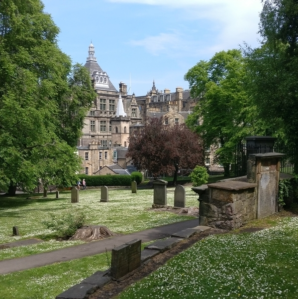
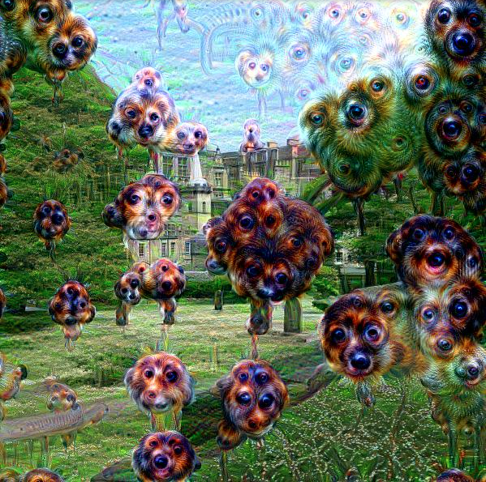

# HW 9

### Contributions
Homework was completed entirely by Willow Fortino.

### What was this homework about?
This homework explored Google's DeepDream.

### What was the <b>hardest</b> part of this homework for you?
Plotting all of the layers.

### What was the <b>easiest</b> part of this homework for you?
Actually using DeepDream was easy (with all of the provided code, haha!)

### What is one new thing you learned?
Was really fascinating seeing the DeepDream layers operate on random noise. I would like to try it out on some other basic images too.

